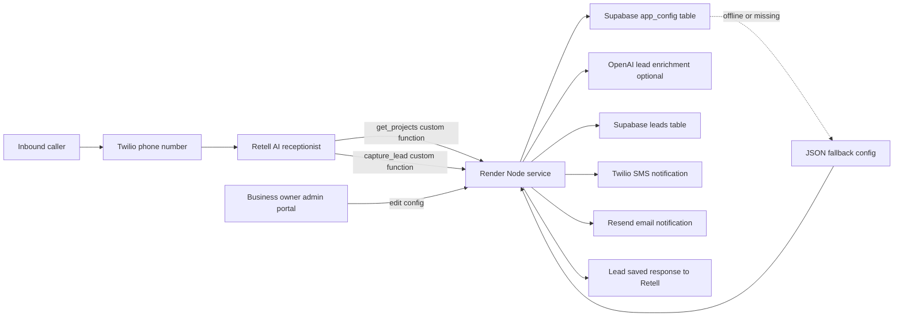
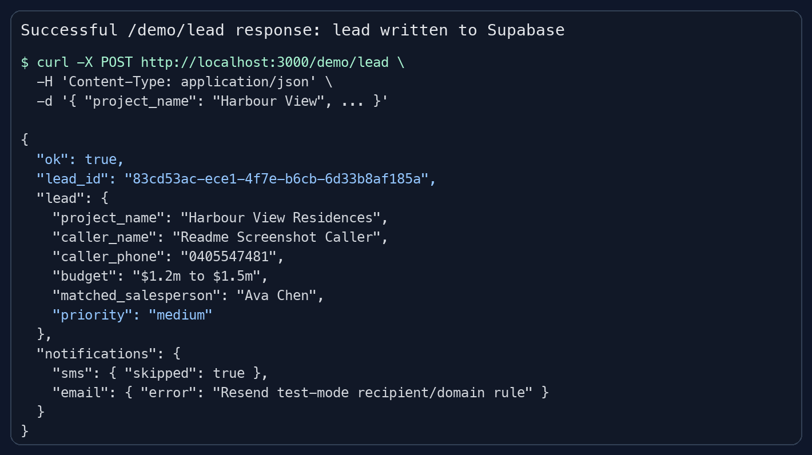
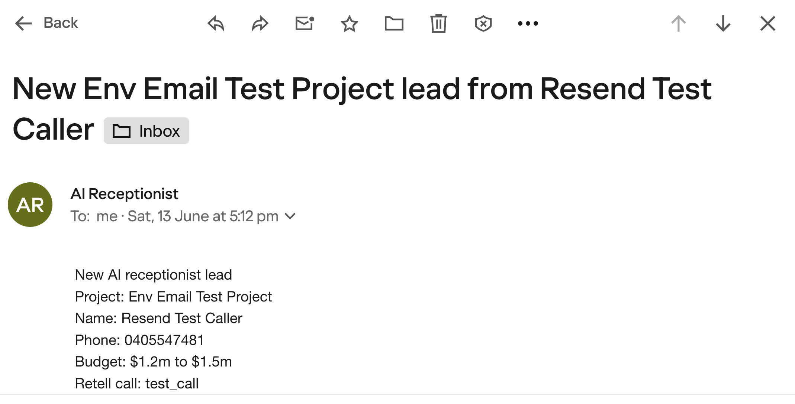

# Retell + Twilio + Supabase Real Estate AI Receptionist Demo

Tiny deployable demo for the SEEK-style system:

Inbound call -> Retell agent asks which project the caller is interested in -> captures name, phone, and budget -> writes the lead to Supabase -> fires SMS/email notification -> deployed on Render.

## Architecture



The current system has two data paths:

- Runtime config: business settings, projects, and priority rules are loaded from Supabase `app_config` first, with local JSON files as fallback.
- Lead capture: Retell collects caller details, the backend matches the project, enriches priority/handoff notes with OpenAI when configured, writes to Supabase `leads`, then sends notifications.

This repo contains the API service and a lightweight admin portal. You still configure the actual Retell voice agent and Twilio number in their dashboards.

Config files used as fallback/defaults:

- `data/business.json`
- `data/projects.json`
- `data/priority-rules.json`

Editable prompt/schema files for Retell:

- `prompts/retell-agent-prompt.md`
- `prompts/get-projects.schema.json`
- `prompts/capture-lead.schema.json`

## Endpoints

| Endpoint | Purpose |
|---|---|
| `GET /health` | Render health check |
| `GET /projects` | Returns current project list from Supabase config or JSON fallback |
| `GET /config` | Returns current business, projects, and priority rules config |
| `GET /admin` | Lightweight admin portal for business/project/priority config |
| `GET /api/admin/config` | Admin API to load config from Supabase or JSON fallback |
| `POST /api/admin/config` | Admin API to save config into Supabase `app_config` |
| `POST /twilio/inbound` | Twilio Voice webhook that returns TwiML to dial Retell SIP |
| `POST /retell/functions/get-projects` | Retell custom function endpoint for dynamic project options |
| `POST /retell/functions/capture-lead` | Retell custom function endpoint |
| `POST /demo/lead` | Local/manual test endpoint without Retell signature |

## 1. Supabase

Run `supabase/schema.sql` in the Supabase SQL editor.

If your `leads` table already exists from an earlier version, run `supabase/add-openai-enrichment-columns.sql` as well to add:

- `handoff_summary`
- `qualification_reason`

The demo uses:

- `public.leads` for captured lead records.
- `public.app_config` for business-owner editable JSON config.

The service talks to Supabase through the REST API with the service role key. Keep the service role key server-side only.

`app_config` stores three rows:

| Key | Value |
|---|---|
| `business` | Business name, timezone, handoff message, notification config references |
| `projects` | Project list, aliases, salesperson routing |
| `priority_rules` | High/low priority keyword rules and default priority |

If Supabase config is missing or offline, the service falls back to the JSON files in `data/`.

## 2. Environment

Copy `.env.example` to `.env` locally, then set the same values in Render.

Required for the core Retell -> Supabase flow:

```bash
RETELL_API_KEY=...
RETELL_AGENT_ID=...
SUPABASE_URL=...
SUPABASE_SERVICE_ROLE_KEY=...
```

Required for the admin portal:

```bash
CONFIG_CACHE_TTL_MS=30000
```

Optional for SMS lead notifications:

```bash
TWILIO_ACCOUNT_SID=...
TWILIO_AUTH_TOKEN=...
TWILIO_FROM_NUMBER=...
NOTIFY_SMS_TO=...
```

Optional for email lead notifications:

```bash
RESEND_API_KEY=...
EMAIL_FROM=...
NOTIFY_EMAIL_TO=...
```

Optional for OpenAI lead enrichment:

```bash
OPENAI_API_KEY=...
OPENAI_MODEL=gpt-4.1-mini
```

Use `gpt-4.1-mini` for this MVP unless you have confirmed another model is available to your OpenAI API key. Model names must be exact.

When `OPENAI_API_KEY` is set, the backend asks OpenAI to return structured JSON for:

- `priority`: `high`, `medium`, or `low`
- `qualification_reason`: why the lead was classified that way
- `handoff_summary`: a concise salesperson handoff note

If OpenAI is not configured, the model is unavailable, or the API call fails, the app falls back to the local priority rules so lead capture still works.

For local testing of `/demo/lead`, Supabase is required. SMS/email are skipped if their env vars are missing. This means the MVP works in both cases:

- no Twilio number yet: lead is saved to Supabase, SMS is skipped, email is sent if configured
- Twilio SMS-capable number provided: lead is saved to Supabase and SMS notification is sent

## 3. Retell Agent Setup

Retell custom functions send a POST request to your endpoint with `name`, `call`, and `args`. This demo also supports Retell's "Payload: args only" mode.

Create a **Single prompt** Retell voice agent with these functions attached:

- `get_projects`
- `capture_lead`

Agent name:

```text
Real Estate AI Receptionist
```

Prompt in the Retell agent:

```text
You are the AI receptionist for an Australian real estate sales and project marketing business.

Your job is to qualify inbound property enquiries and create a lead for the sales team.

Before offering project options, call the custom function `get_projects` to retrieve the current project list from the backend.

If `get_projects` succeeds, use the returned project names as the available projects.
If `get_projects` fails, continue politely and ask the caller which project they are interested in, then let `capture_lead` send the caller's project wording to the backend for matching.

Conversation flow:
1. Greet the caller warmly.
2. Call `get_projects`.
3. Ask which project they are interested in, using the returned project names when available.
4. Capture their full name.
5. Capture their best callback phone number.
6. Ask their approximate budget or price range.
7. Confirm the details back to the caller.
8. Once you have project name, caller name, phone number, and budget, call the custom function `capture_lead`.
9. After `capture_lead` succeeds, tell the caller that the right salesperson has been notified and will follow up.

Rules:
- Call `get_projects` once near the start of the conversation before listing project options.
- Do not call `capture_lead` until all required details are collected.
- Keep questions short and natural.
- If the caller is unsure which project, offer the project names returned by `get_projects`.
- If the caller names a project that sounds close to one of the returned projects, capture the caller's wording naturally. The backend will match it.
- Read phone numbers back carefully.
- If a caller refuses to provide a detail, politely explain it is needed so the sales team can follow up.
- Never invent property availability, prices, discounts, investment returns, legal advice, or financial advice.
- If the caller asks about something unrelated, such as going out to dinner, restaurants, personal chat, jokes, general advice, or any topic not related to real estate enquiries, respond politely and redirect them back to the property enquiry. Example: "I can only help with property project enquiries today. Which project are you interested in?"
```

Add a Retell custom function for dynamic projects:

```json
{
  "name": "get_projects",
  "description": "Return the current real estate project list from the backend so the agent can offer accurate project options.",
  "method": "POST",
  "url": "https://YOUR-RENDER-SERVICE.onrender.com/retell/functions/get-projects",
  "headers": {
    "Content-Type": "application/json"
  },
  "parameters": {
    "type": "object",
    "properties": {}
  }
}
```

Add a Retell custom function for lead capture:

```json
{
  "name": "capture_lead",
  "description": "Save a qualified real estate project enquiry lead after project, name, phone and budget have been collected.",
  "method": "POST",
  "url": "https://YOUR-RENDER-SERVICE.onrender.com/retell/functions/capture-lead",
  "headers": {
    "Content-Type": "application/json"
  },
  "parameters": {
    "type": "object",
    "required": ["project_name", "caller_name", "caller_phone", "budget"],
    "properties": {
      "project_name": {
        "type": "string",
        "description": "The real estate project the caller is interested in."
      },
      "caller_name": {
        "type": "string",
        "description": "The caller's full name."
      },
      "caller_phone": {
        "type": "string",
        "description": "The caller's best callback phone number."
      },
      "budget": {
        "type": "string",
        "description": "The caller's approximate budget or price range."
      }
    }
  }
}
```

JSON in the custom function parameter schema:

```json
{
  "type": "object",
  "required": [
    "project_name",
    "caller_name",
    "caller_phone",
    "budget"
  ],
  "properties": {
    "caller_name": {
      "type": "string",
      "description": "The caller's full name."
    },
    "caller_phone": {
      "type": "string",
      "description": "The caller's best callback phone number."
    },
    "project_name": {
      "type": "string",
      "description": "The real estate project the caller is interested in."
    },
    "budget": {
      "type": "string",
      "description": "The caller's approximate budget or price range."
    }
  }
}
```

Recommended custom function speech behavior:

- Speak during execution: off, or a short "Let me save that for the sales team."
- Speak after execution: on.

Signature verification is enabled by default using `X-Retell-Signature`. For quick local testing only, set:

```bash
RETELL_VERIFY_SIGNATURE=false
```

## 4. Twilio Inbound Call Setup

Twilio is optional for the first backend MVP. If you do not have a Twilio number yet, test the Retell agent through Retell's own test tools and use the Retell custom function endpoint to save leads.

When you are ready for public inbound calls, there are two practical patterns.

### Option A: Retell SIP trunk / imported number

Use Retell's custom telephony setup with Twilio Elastic SIP Trunking and import/bind the number in Retell. This is the cleaner production approach.

### Option B: Twilio webhook returns TwiML that dials Retell SIP

Set your Twilio number's Voice webhook to:

```text
https://YOUR-RENDER-SERVICE.onrender.com/twilio/inbound
```

The endpoint returns:

```xml
<Response>
  <Say voice="alice">Connecting you to our AI property receptionist.</Say>
  <Dial>
    <Sip>sip:sip.retellai.com;transport=tcp</Sip>
  </Dial>
</Response>
```

If your Retell/Twilio setup needs a different SIP URI, set:

```bash
RETELL_SIP_URI=sip:your-configured-retell-or-trunk-uri
```

## 5. Render Deployment

1. Push this folder to GitHub.
2. In Render, create a new Web Service from the repo.
3. Use:
   - Build command: `npm install`
   - Start command: `npm start`
   - Health check path: `/health`
4. Add the env vars from `.env.example`.
5. Use the Render URL in Retell and Twilio.

`render.yaml` is included if you prefer Render Blueprint deployment.

## 6. Admin Portal

After deployment, open:

```text
https://YOUR-RENDER-SERVICE.onrender.com/admin
```

The page loads the current business, projects, and priority-rules JSON automatically. Click **Load** to refresh it manually.

The admin portal lets a business owner edit:

- Business JSON: business name, timezone, handoff message, notification env references
- Projects JSON: project names, aliases, salesperson routing
- Priority Rules JSON: high/low intent keywords and default priority

Click **Save to Supabase** to write the major editable config to `public.app_config`.

Fallback behavior:

- Normal operation: load config from Supabase `app_config`.
- Missing/offline config: use `data/business.json`, `data/projects.json`, and `data/priority-rules.json`.
- Retell still works during fallback because `get_projects` and `capture_lead` both use the same runtime config loader.

## 7. OpenAI Lead Enrichment

OpenAI enrichment happens inside the backend after the Retell function payload is normalized and before the lead is inserted into Supabase.

Flow:

```text
Retell args -> normalize lead -> match project -> OpenAI enrichment -> Supabase insert -> SMS/email notification
```

The OpenAI request uses the Responses API with a strict JSON schema. The response must contain:

```json
{
  "priority": "high",
  "qualification_reason": "Caller has a strong budget and wants to inspect this week.",
  "handoff_summary": "High-priority Bondi lead. Call today to arrange an inspection."
}
```

Stored Supabase fields:

| Field | Purpose |
|---|---|
| `priority` | Sales follow-up priority: `high`, `medium`, or `low` |
| `qualification_reason` | Explanation generated by OpenAI or fallback rules |
| `handoff_summary` | Short handoff note for the salesperson |

Existing Supabase projects should run:

```sql
alter table public.leads
add column if not exists handoff_summary text;

alter table public.leads
add column if not exists qualification_reason text;
```

Expected behavior:

- With `OPENAI_API_KEY`: response includes `enrichment_source: "openai"` when enrichment succeeds.
- Without `OPENAI_API_KEY`: response includes `enrichment_source: "rules"`.
- If OpenAI returns an invalid priority, the backend keeps the existing calculated priority.
- If OpenAI returns an error, such as an unavailable model, lead capture still succeeds using fallback rules.

Run the OpenAI test suite:

```bash
npm test
```

The tests cover structured JSON output, model selection via `OPENAI_MODEL`, API failure fallback, invalid priority fallback, and nested Responses API output parsing.

## 8. Local Run

```bash
npm install
npm run dev
```

Health check:

```bash
curl http://localhost:3000/health
```

Manual lead test:

```bash
curl -X POST http://localhost:3000/demo/lead \
  -H 'Content-Type: application/json' \
  -d '{
    "project_name": "Harbour View",
    "caller_name": "Linda Liu",
    "caller_phone": "0405 547 481",
    "budget": "$1.2m to $1.5m"
  }'
```

Example `/demo/lead` response showing a lead written to Supabase:



With OpenAI configured, the `/demo/lead` response should include fields like:

```json
{
  "ok": true,
  "lead_id": "uuid-here",
  "enrichment_source": "openai",
  "lead": {
    "priority": "high",
    "qualification_reason": "Caller has a strong budget and clear project interest.",
    "handoff_summary": "Call Linda today about Harbour View Residences and confirm inspection timing."
  }
}
```

Example Resend email notification received after lead capture:



Twilio webhook shape test:

```bash
curl -X POST http://localhost:3000/twilio/inbound \
  -H 'Content-Type: application/x-www-form-urlencoded' \
  -d 'CallSid=CA123&From=%2B61405547481&To=%2B61280000000'
```

## Production Hardening Notes

- Add Twilio request signature validation before trusting Twilio webhooks.
- Keep `RETELL_VERIFY_SIGNATURE=true` outside local development.
- Add authentication before exposing the admin portal beyond this basic MVP.
- Add RLS policies if you expose Supabase data directly to a frontend.
- Consider an audit log for admin config changes before using this with multiple staff.
- Add duplicate lead handling by caller phone and project within a time window.
- Add call-ended webhook processing to reconcile transcript, recording URL, and final call outcome.
