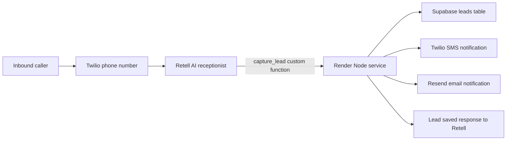

# Retell + Twilio + Supabase Real Estate AI Receptionist Demo

Tiny deployable demo for the SEEK-style system:

Inbound call -> Retell agent asks which project the caller is interested in -> captures name, phone, and budget -> writes the lead to Supabase -> fires SMS/email notification -> deployed on Render.

## Architecture



This repo contains the API service only. You still configure the actual Retell voice agent and Twilio number in their dashboards.

## Endpoints

| Endpoint | Purpose |
|---|---|
| `GET /health` | Render health check |
| `GET /projects` | Returns demo project list and salesperson routing |
| `POST /twilio/inbound` | Twilio Voice webhook that returns TwiML to dial Retell SIP |
| `POST /retell/functions/capture-lead` | Retell custom function endpoint |
| `POST /demo/lead` | Local/manual test endpoint without Retell signature |

## 1. Supabase

Run `supabase/schema.sql` in the Supabase SQL editor.

The demo writes to `public.leads` using Supabase REST API and the service role key. Keep the service role key server-side only.

## 2. Environment

Copy `.env.example` to `.env` locally, then set the same values in Render.

Required for the core Retell -> Supabase flow:

```bash
RETELL_API_KEY=...
RETELL_AGENT_ID=...
SUPABASE_URL=...
SUPABASE_SERVICE_ROLE_KEY=...
```

Optional for SMS lead notifications:

```bash
TWILIO_ACCOUNT_SID=...
TWILIO_AUTH_TOKEN=...
TWILIO_FROM_NUMBER=...
NOTIFY_SMS_TO=...
```

Optional for email lead notifications:

```bash
RESEND_API_KEY=...
EMAIL_FROM=...
NOTIFY_EMAIL_TO=...
```

For local testing of `/demo/lead`, Supabase is required. SMS/email are skipped if their env vars are missing. This means the MVP works in both cases:

- no Twilio number yet: lead is saved to Supabase, SMS is skipped, email is sent if configured
- Twilio SMS-capable number provided: lead is saved to Supabase and SMS notification is sent

## 3. Retell Agent Setup

Retell custom functions send a POST request to your endpoint with `name`, `call`, and `args`. This demo also supports Retell's "Payload: args only" mode.

Create a single-prompt or multi-prompt Retell voice agent with this prompt:

```text
You are the AI receptionist for an Australian real estate sales and project marketing business.

Goal:
Qualify inbound property enquiries and create a clean lead for the sales team.

Conversation flow:
1. Greet the caller warmly.
2. Ask which project they are interested in.
   Available projects:
   - Harbour View Residences
   - Parramatta Square Living
   - Bondi Beach Collection
3. Capture their full name.
4. Capture their best phone number.
5. Ask their approximate budget or price range.
6. Confirm the details back briefly.
7. Once project, name, phone, and budget are all available, call the custom function `capture_lead`.
8. If the function succeeds, tell the caller that the right salesperson has been notified and will follow up.

Rules:
- Do not call `capture_lead` until all four required fields are collected.
- If the caller is unsure about the exact project, ask clarifying questions and use the nearest available project name.
- Keep questions short and natural.
- Read phone numbers back carefully.
- If the caller refuses a detail, explain it is needed for the salesperson to follow up.
```

Add a Retell custom function:

```json
{
  "name": "capture_lead",
  "description": "Save a qualified real estate project enquiry lead after project, name, phone and budget have been collected.",
  "method": "POST",
  "url": "https://YOUR-RENDER-SERVICE.onrender.com/retell/functions/capture-lead",
  "headers": {
    "Content-Type": "application/json"
  },
  "parameters": {
    "type": "object",
    "required": ["project_name", "caller_name", "caller_phone", "budget"],
    "properties": {
      "project_name": {
        "type": "string",
        "description": "The real estate project the caller is interested in."
      },
      "caller_name": {
        "type": "string",
        "description": "The caller's full name."
      },
      "caller_phone": {
        "type": "string",
        "description": "The caller's best callback phone number."
      },
      "budget": {
        "type": "string",
        "description": "The caller's approximate budget or price range."
      }
    }
  }
}
```

Recommended custom function speech behavior:

- Speak during execution: off, or a short "Let me save that for the sales team."
- Speak after execution: on.

Signature verification is enabled by default using `X-Retell-Signature`. For quick local testing only, set:

```bash
RETELL_VERIFY_SIGNATURE=false
```

## 4. Twilio Inbound Call Setup

Twilio is optional for the first backend MVP. If you do not have a Twilio number yet, test the Retell agent through Retell's own test tools and use the Retell custom function endpoint to save leads.

When you are ready for public inbound calls, there are two practical patterns.

### Option A: Retell SIP trunk / imported number

Use Retell's custom telephony setup with Twilio Elastic SIP Trunking and import/bind the number in Retell. This is the cleaner production approach.

### Option B: Twilio webhook returns TwiML that dials Retell SIP

Set your Twilio number's Voice webhook to:

```text
https://YOUR-RENDER-SERVICE.onrender.com/twilio/inbound
```

The endpoint returns:

```xml
<Response>
  <Say voice="alice">Connecting you to our AI property receptionist.</Say>
  <Dial>
    <Sip>sip:sip.retellai.com;transport=tcp</Sip>
  </Dial>
</Response>
```

If your Retell/Twilio setup needs a different SIP URI, set:

```bash
RETELL_SIP_URI=sip:your-configured-retell-or-trunk-uri
```

## 5. Render Deployment

1. Push this folder to GitHub.
2. In Render, create a new Web Service from the repo.
3. Use:
   - Build command: `npm install`
   - Start command: `npm start`
   - Health check path: `/health`
4. Add the env vars from `.env.example`.
5. Use the Render URL in Retell and Twilio.

`render.yaml` is included if you prefer Render Blueprint deployment.

## 6. Local Run

```bash
npm install
npm run dev
```

Health check:

```bash
curl http://localhost:3000/health
```

Manual lead test:

```bash
curl -X POST http://localhost:3000/demo/lead \
  -H 'Content-Type: application/json' \
  -d '{
    "project_name": "Harbour View",
    "caller_name": "Linda Liu",
    "caller_phone": "0405 547 481",
    "budget": "$1.2m to $1.5m"
  }'
```

Twilio webhook shape test:

```bash
curl -X POST http://localhost:3000/twilio/inbound \
  -H 'Content-Type: application/x-www-form-urlencoded' \
  -d 'CallSid=CA123&From=%2B61405547481&To=%2B61280000000'
```

## Production Hardening Notes

- Add Twilio request signature validation before trusting Twilio webhooks.
- Keep `RETELL_VERIFY_SIGNATURE=true` outside local development.
- Add RLS policies if you expose Supabase data to a frontend.
- Move project/salesperson routing into Supabase for real campaigns.
- Add duplicate lead handling by caller phone and project within a time window.
- Add call-ended webhook processing to reconcile transcript, recording URL, and final call outcome.
